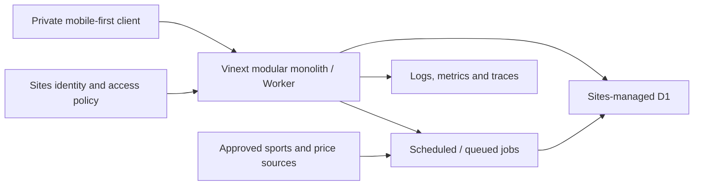
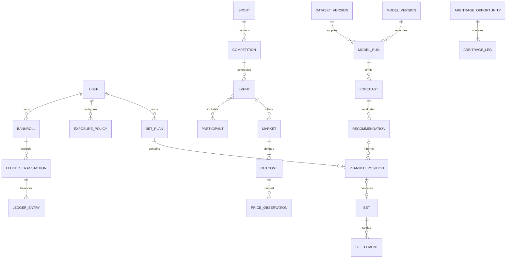

# Canonical MVP architecture

Status: accepted for MVP foundation (2026-08-27)

Matthematical Kalma is a private, mobile-first sports-market intelligence and disciplined bankroll-management product. It is independent decision support: it does not place bets, store bookmaker credentials, operate an online in-play workflow, or publish tips. The MVP is one Vinext application and Cloudflare Worker, organised as a modular monolith.

This is the canonical MVP architecture and data/audit contract. Focused decisions in [docs/adr](adr/README.md) are normative where they add detail.

## 1. System boundary and modules

The server is the trust boundary. Browser storage may hold temporary UI drafts and device presentation preferences, never authoritative identity, bankroll, limits, bets, recommendations, or audit history. Raw provider payloads remain separate from canonical records. Demo fixtures are test/development assets only and never production runtime state.

| Module | Owns | Excludes |
| --- | --- | --- |
| Identity & preferences | Internal users, identity mappings, settings, export/deletion state | Authentication secrets and bookmaker credentials |
| Sports catalogue | Sports, competitions, participants, aliases, events, results | Provider-specific UI models |
| Market data | Operators, rulesets, markets, outcomes, timestamped prices | Forecasts and personal positions |
| Data & modelling | Sources, dataset/model versions, runs, forecasts | Stake sizing |
| Recommendation | Baselines, Bet/Watch/Pass, explanations, audit bundles | Mutation of published decisions |
| Bankroll & risk | Bankrolls, reconciled ledger, limits, exposure evaluations, responsible-use events | Results and forecasts |
| Bet Plan & bets | Plans, positions, manual bet records and user actions | Automatic placement |
| Settlement | Result revisions, settlement, void and correction events | Destructive history edits |
| Evaluation | Performance, closing-line value and calibration | Authoritative balances |
| Arbitrage | Scan observations, immutable opportunity snapshots and legs | Predictive value or execution |
| Audit & operations | Provenance, idempotency receipts, jobs, exports and deletion tombstones | Duplicated domain decisions |

Modules expose typed commands, queries and domain events. A module cannot update another module’s tables directly. Cross-module writes use an application service and one D1 transaction or an explicitly recorded compensating workflow.

## 2. Runtime responsibilities

### Frontend

- Preserve the established 375px-first, blue/yellow, compact information hierarchy without imitating a bookmaker.
- Request typed server APIs; never authoritatively calculate balance, exposure eligibility, settlement return, or recommendation state.
- Display source time, freshness, uncertainty, constraints and Pass prominently.
- Send a client request ID/idempotency key for retriable writes.

### Backend

- Derive identity from trusted Sites request headers and map it to an internal user.
- Apply owner scoping before repository access.
- Validate commands, coordinate modules and commit related changes atomically.
- Create immutable recommendation, ledger, settlement and provenance facts.
- Return explicit empty, stale, unavailable, forbidden and conflict states.

### Persistence and background work

Sites-managed D1 is the MVP system of record. Foreign keys are enabled; constraints enforce ownership, uniqueness, ranges and simple state rules. R2 remains unbound until large input artifacts or exports require blob storage; if added, D1 retains ownership, checksum, type, size and lifecycle metadata.

Scheduled/queued jobs handle imports, canonical matching, freshness transitions, model runs, closing-price capture, settlement proposals, evaluation, export and retention. Jobs use leases, checkpoints, idempotency keys, bounded retries and observable run records. They call the same application services and cannot bypass audit or ownership rules.

## 3. Universal record conventions

Canonical records use opaque UUIDv7-style IDs, UTC `created_at`, and—when editable—UTC `updated_at` plus integer `version`. Foreign IDs are never primary keys. Material state changes use events/revisions, not destructive replacement.

Ownership classes:

- **Shared reference:** sports, events, operators, prices, datasets, models and aggregate model evaluation.
- **User-owned:** preferences, bankrolls, limits, plans, bets, notes, personal recommendations/performance and exports. Every root and child is transitively owned by exactly one internal user.
- **System audit:** provenance, runs, recommendation bundles, corrections, jobs and idempotency receipts. Service-written; may be user-scoped.

### Users and preferences

| Record | Definition / relationships | Owner | Lifecycle |
| --- | --- | --- | --- |
| `users` | Internal subject with status, locale, display timezone and deletion state; no auth secret | User | provisioned → active → suspended/deletion_pending → deleted tombstone |
| `user_identities` | Unique `(issuer, subject)` Sites mapping; email is display/contact metadata, not authority | User | linked → revoked/replaced |
| `user_preferences` | Preferred sports, competitions, markets, operators and display choices | User | editable with optimistic concurrency; material change history |

### Bankroll, ledger and controls

| Record | Definition / relationships | Owner | Lifecycle |
| --- | --- | --- | --- |
| `bankrolls` | Paper or optional manual-real-money account with currency; MVP allows one active paper bankroll per user. Balance is derived | User | draft → active → closed |
| `ledger_transactions` | Atomic business transaction with type, effective time, idempotency key, reason/source and reversal link | User | posted once; corrected by reversal/replacement |
| `ledger_entries` | Signed integer-minor-unit postings in one transaction across clearing/equity/stake/return/fee categories | User | immutable |
| `exposure_policies` | Versioned limits for bet, event, sport, day/week, loss/drawdown, mode and cooling-off | User | draft → active → superseded |
| `exposure_evaluations` | Policy version + bankroll/open-exposure snapshot + deterministic result/reasons | User | immutable per sizing decision |
| `responsible_use_events` | Cooling-off, real-money disablement, warnings, acknowledgements and limit effective times | User | append-only |

Ledger invariants:

- Money changes only through balanced transaction groups; signed entries sum to zero.
- Deposit, withdrawal, stake reservation/release, return, fee and adjustment are distinct types.
- Correction posts equal-and-opposite entries against the original before corrected entries.
- Cached balances are disposable and must reconcile to the immutable ledger.

### Sports and market reference data

| Record | Definition / relationships | Owner | Lifecycle |
| --- | --- | --- | --- |
| `sports` | Canonical sport code and rules family | Shared | active → retired |
| `competitions` | League/tour within a sport, canonical timezone and season scheme | Shared | active → retired |
| `participants` | Provider-independent team/player/fighter | Shared | provisional → verified → merged/retired |
| `participant_aliases` | Provider-scoped ID/name mapping, confidence and reviewer | Shared | proposed → verified/rejected/superseded |
| `events` | Competition contest, scheduled start, status, venue and identity confidence | Shared | scheduled → postponed/cancelled/started → completed; corrected by revision |
| `event_participants` | Participant role/order for one event revision | Shared | immutable when revision published |
| `event_results` | Versioned sourced result fact, distinct from personal settlement | Shared | proposed → confirmed → corrected/voided by later revision |
| `operators` | Bookmaker/exchange identity and jurisdiction | Shared | active → suspended/retired |
| `operator_rulesets` | Effective-dated commission and settlement rules | Shared | superseded, never overwritten |
| `markets` | Event market using a versioned definition; MVP is pre-match | Shared | open → suspended/closed → settled/void |
| `outcomes` | Exhaustive mutually exclusive selections and canonical line/handicap | Shared | published → settled/void |
| `price_observations` | Operator/outcome decimal quote, availability, known limits/liquidity, provider observation and receipt times | Shared | append-only |

### Data, models, forecasts and recommendations

| Record | Definition / relationships | Owner | Lifecycle |
| --- | --- | --- | --- |
| `data_sources` | Provider/manual identity, terms/version and reliability class | Shared | configured → active → retired |
| `source_artifacts` | Source locator, retrieval, SHA-256, schema version and optional redacted payload/blob reference | System | immutable; bytes may expire under policy, metadata/hash remain |
| `dataset_versions` | Source-artifact/transform manifest, data cutoff, feature schema and content hash | Shared | building → sealed → deprecated |
| `model_versions` | Algorithm/config/code ID, scope, training dataset and evaluation state | Shared | candidate → approved → retired; approved version immutable |
| `model_runs` | Model/dataset/code versions, parameters, seed, input hash, timestamps and status | System | queued → running → succeeded/failed/cancelled |
| `forecasts` | Per-outcome probability, uncertainty, feature-as-of and evaluation cohort | Shared | emitted once; invalidation appends |
| `market_baselines` | De-vig method, exact eligible price IDs, consensus probabilities and as-of time | Shared | immutable snapshot |
| `recommendations` | Bet/Watch/Pass for forecast/outcome/price with rules, edge, fair odds, confidence and reasons; personal decisions also reference owner and exposure evaluation | System/user-scoped | published → expired/ineligible/withdrawn by event; payload immutable |
| `recommendation_events` | Publication, view, accept, change, ignore, expiry and invalidation | System/user | append-only |

Every published recommendation freezes: forecast; all mutually exclusive probabilities; run/model/dataset/input manifest; baseline and exact price IDs; event/market revisions; decision-rule version; code revision; timestamps; reason codes; and, when personal, ledger/exposure cutoff, policy version and exposure evaluation. It has a canonical content hash.

### Bet Plans, bets and settlement

| Record | Definition / relationships | Owner | Lifecycle |
| --- | --- | --- | --- |
| `bet_plans` | Deliberate collection of proposed positions for one bankroll | User | draft → confirmed/abandoned/expired |
| `planned_positions` | Outcome, optional recommendation, target operator/price/stake, governed max, correlation group and exposure evaluation | User | editable draft → confirmed/removed/expired; revisions kept |
| `bets` | Manual record of paper or externally placed position with actual odds, stake, time and operator | User | open → settlement_pending → settled/void; corrected by events |
| `bet_events` | Created, confirmed, note/tag, settlement proposal, settlement, void, reversal and correction | User/system | append-only |
| `settlements` | Calculation against one result/ruleset: status, gross return, fees, net return and ledger transaction | User | proposed → posted; superseded by reversal + corrected settlement |

A manual bet may lack a recommendation but must use `entry_source = manual_external` and is excluded from model-following cohorts. A recommendation-derived bet freezes recommended and actual values separately.

### Evaluation and arbitrage

| Record | Definition / relationships | Owner | Lifecycle |
| --- | --- | --- | --- |
| `closing_price_records` | Defined closing observation/baseline and capture policy | Shared | pending → captured/unavailable; corrections append |
| `performance_records` | Versioned cohort metric: P/L, ROI, drawdown, scoring and sample size | Shared/user | rebuildable derived record; never money authority |
| `clv_records` | Recommendation/bet price versus versioned closing benchmark | Shared/user | derived; recalculation creates new version |
| `calibration_records` | Forecast cohort/bin, predicted and observed rates, scores and sample size | Shared | derived/versioned |
| `arbitrage_observations` | One scan over an equivalence group, considered prices and rejection reasons | Shared | append-only |
| `arbitrage_opportunities` | Qualified kind, implied sum, fees, return, freshness cutoff, expiry and completeness | Shared | observed → revalidated/expired/rejected; snapshot immutable |
| `arbitrage_legs` | Outcome/operator/price ID, stake allocation, commission, limits/liquidity and rounding | Shared | immutable child |

## 4. Relationships and aggregate boundaries

Aggregate boundaries are User/identity, Bankroll transaction, Exposure policy, Event revision, Market/outcomes, Dataset version, Model run/forecasts, Recommendation audit bundle, Bet Plan, Bet/settlement and Arbitrage snapshot. Historical consumers pin IDs and versions; they never follow a mutable “latest” pointer during replay.

## 5. Immutable versus editable

Immutable after publication/posting: source artifacts and price observations; sealed datasets; approved model versions; completed runs and forecasts; published recommendations and inputs; ledger postings; bet/settlement/correction events; result revisions; closing captures; exposure evaluations; arbitrage snapshots; audit events and idempotency receipts.

Editable with version/conflict checks: profile display data, ordinary preferences, draft Plans/positions, notes/tags (with history where material), provisional mappings, and future exposure limits subject to responsible-use rules.

User-visible removal becomes archive, redaction, withdrawal or appended reversal. Physical erasure occurs only through the privacy deletion workflow, leaving non-identifying completion/reconciliation evidence where necessary.

## 6. Recommendation reproduction

An authorised audit query by `recommendation_id` returns:

1. Immutable payload and canonical hash.
2. Exact event, market, outcome, operator and price revisions.
3. Forecast and all outcome probabilities.
4. Model version, code revision, parameters, seed and run environment.
5. Dataset/input manifest, feature schema, source hashes and cutoff.
6. De-vig/baseline method and included/excluded price IDs.
7. Decision-rule version, thresholds, uncertainty and quality gates.
8. For personal output: owner, ledger cutoff, open exposure, policy version and evaluation.
9. Fair odds, edge, EV, suggested stake and reason codes.
10. Observed, received, effective, created, published and expiry times.

**Verification replay** recomputes from retained canonical inputs within a declared tolerance. **Forensic replay** additionally uses the original executable/model artifact. If licensing prevents raw retention, checksum, canonical extracted fields, source locator, receipt, terms version and transform manifest are mandatory and the limitation is explicit.

Recommendations may be invalidated, expired or withdrawn, never edited silently. Corrections reference the original, actor/source, reason, time and a new content hash.

## 7. Idempotency, deduplication and provenance

- Retriable commands require `Idempotency-Key`, scoped by authenticated user + command, with request hash, response reference and expiry. Reuse with a different request conflicts.
- Provider ingestion keys stable records by `(source, type, source_id, source_version/observed_at)`; absent stable IDs, use a documented canonical fingerprint plus payload SHA-256.
- Price uniqueness uses source quote ID, or `(operator, outcome, observed_at, odds_scaled, availability, payload_hash)`. Same-price observations at different source times remain valid.
- Event matching uses sport, competition, participants, start tolerance and venue. Ambiguity is quarantined, never guessed.
- Dataset/input/recommendation bundles use deterministic canonical JSON + SHA-256.
- Imported facts store source/provider time, receipt time, adapter/schema version, quality, artifact hash, ingestion run and correction chain.
- Delivery is at-least-once; unique constraints and receipts make domain effects exactly-once.

## 8. Time and freshness

- Persist instants as UTC ISO-8601 text with milliseconds. Reject offset-free datetimes.
- Store user display and competition/event IANA timezones separately; never use abbreviations as authority.
- Distinguish `source_observed_at`, `received_at`, `effective_at`, `created_at`, `published_at`, `event_start_at`, `settled_at` and `corrected_at`.
- Provider observation time and receipt time are never substituted for each other; skew/late delivery creates quality flags.
- Versioned policies define quote-age limits by sport/market/operator/use. The applied policy and evaluated freshness are frozen with each decision.
- No actionable recommendation publishes at/after canonical start. An earlier start-time correction invalidates affected recommendations without deleting them.
- Pre-match markets close at the earliest of confirmed start, provider suspension or safety cutoff. Late prices remain audit facts but are ineligible.
- Closing price follows a versioned rule, not ad hoc “latest.”

## 9. Money, odds and probability precision

- Money is signed 64-bit integer minor units plus ISO 4217 currency. MVP bankrolls are single-currency. Binary floating point never posts/reconciles money.
- Decimal odds enter as canonical strings and store at scale 1e-6 (`decimal_odds_micros`), greater than 1.000000. Retain the provider string in provenance.
- Probabilities store at scale 1e-9 (`probability_nanos`), inclusive 0–1; mutually exclusive outcomes meet a declared sum tolerance.
- Edge, Kelly, commission, ROI and CLV use signed 1e-9 scale or exact rational inputs.
- Server calculations use exact decimal/integer arithmetic and versioned rounding. Money defaults to half-even minor-unit rounding unless an operator ruleset says otherwise.
- APIs return authoritative decimal strings plus scale, not IEEE-754 JSON numbers. UI rounding is presentation only.

## 10. Isolation, privacy, export and deletion

- Sites authenticates; the application maps trusted issuer/subject to internal `users.id`. Email is not authority.
- Site policy controls admission. Server authorization scopes every personal query/command by `owner_user_id`; client owner IDs are ignored.
- Repository APIs require `OwnerContext`. System jobs require an explicit service capability and audit reason.
- Composite ownership checks ensure children share the parent owner. Opaque IDs are not security.
- Logs/traces omit email, notes, raw payloads, balances/stakes and tokens; use pseudonymous IDs.
- Export creates a versioned machine-readable package of profile, preferences, policies, plans, bets, ledger, settlements and personal audit references with checksums/times.
- Deletion is authenticated, confirmed, asynchronous and resumable: freeze writes; optional export; revoke access; delete/anonymise user data in dependency order; retain only required non-identifying tombstones/shared facts; verify completion. Backups expire per retention.
- Shared market/model facts survive a user deletion. Personalised recommendation/exposure links are erased or irreversibly anonymised.

Step 2 must prove two-user isolation across object IDs, lists, search, pagination, aggregates, jobs, export and deletion.

## 11. Initial APIs and services

Version initial HTTP APIs under `/api/v1`. Routes call application services; services call module repositories.

| Boundary | Commands / queries |
| --- | --- |
| Session/profile | `GET /me`, preferences, export/delete status |
| Catalogue | sports, competitions, events and analysis |
| Markets | outcome prices/history with freshness and quality |
| Forecasts | detail and immutable audit view |
| Recommendations | ranked feed, detail and action events; published payload read-only |
| Bankroll | paper bankroll, balance/ledger, idempotent adjustment |
| Risk | policy versions, exposure and deterministic evaluation |
| Bet Plan | create/edit/confirm/abandon with optimistic version |
| Bets | manual record, notes/tags, settle/void/correct commands |
| Evaluation | personal performance/CLV and shared calibration |
| Arbitrage | pre-match observations/opportunities, read-only MVP |
| Admin ingestion | service-only imports, mapping review and jobs |

Errors have stable codes and request IDs. Commands include schema version, idempotency key where retriable and expected record version where editable. History/feed endpoints use cursor pagination. Transactional outbox events (`PriceObserved`, `ForecastPublished`, `RecommendationPublished`, `BetRecorded`, `SettlementPosted`, `LimitChanged`) support background consumers without committing to a broker.

## 12. Migrations, testing and observability

### Migrations

- Ordered immutable SQL migrations live in source; never edit an applied migration.
- Prefer additive expand/contract. Destructive changes need backup/export verification, data migration, forward-fix plan and approval.
- Each environment has separate D1 and migration history. Production verifies foreign keys and integrity.
- Backfills are resumable/idempotent with progress and reconciliation.
- Seed only deterministic reference/test data in local/test. Production starts with genuine empty user state and has no demo import path.

### Tests

- Unit/property: odds, de-vig, Kelly caps, integer money, ledger balancing, settlement, CLV, calibration, freshness and timezone edges.
- Schema/contract: constraints, state rules, serialization/hashes and API compatibility.
- Repository integration against SQLite/D1 semantics with foreign keys.
- Isolation: every personal read/write, guessed ID, pagination, aggregates, jobs, export/deletion using two users.
- Golden replay: fixed inputs reproduce recommendation/hash; invalidation preserves original.
- Ingestion: duplicates, reordering, late quotes, alias ambiguity, corrections and schema drift.
- End-to-end: empty onboarding → bankroll → governed plan → manual bet → settlement → reversal/reconciliation.

### Observability

- Structured logs: request/job/run ID, module, operation, duration, outcome, pseudonymous actor/source.
- Metrics: request errors/latency, job lag/retries, coverage, duplicates/quarantine, price age, recommendation states, settlement lag, ledger imbalance (always zero), replay mismatch, isolation denial and privacy workflow progress.
- Traces: receipt → canonical record → run → forecast → recommendation → plan/bet → settlement/evaluation.
- Alerts: missing/ambiguous mappings, start changes, stale prices, probability-sum violations, result conflict and missed closing capture.
- Domain audit evidence and short-lived diagnostic logs have separate retention.

## 13. Now versus deferred

Decided now:

- Existing Sites/Vinext/Cloudflare modular monolith.
- Sites-managed D1 relational authority; R2 only when blob needs are proven.
- Sites identity mapped internally; mandatory server owner scoping.
- Append-only observations, forecasts, recommendations, ledger, settlements and corrections.
- Ledger-derived balances and balanced transactions.
- UTC instants, IANA zones, explicit freshness/pre-start policy.
- Integer/scaled values and versioned rounding.
- Provider-neutral records, provenance, hashes and idempotent writes.
- No production demo runtime state.

Safely deferred:

- Providers, licensing and raw-payload retention.
- Alternative public auth if Sites identity no longer fits private MVP.
- Paper-only versus optional manual real-money (supported by `bankroll.kind`).
- ATP/WTA scope, AFL second market, operator coverage and model algorithms.
- Arbitrage MVP versus parallel beta.
- R2, queue technology, notifications, warehouse and service extraction.
- Shared workspaces, which require explicit future workspace/roles and never weaken `owner_user_id`.

Provider selection does not block Step 2. The only platform dependency is admitting the second intended user through supported Site access/SIWC; the internal identity and isolation model is unchanged.

## Step 1 acceptance map

- Every core record has definition, owner and lifecycle.
- Personal roots have one owner and enforced transitive ownership.
- Money reconciles through immutable balanced entries.
- Forecast/recommendation bundles freeze source, model, data, code, time and policy.
- Recommendations, settlement, void and correction history cannot be silently rewritten.
- Demo fixtures are test/development-only.
- Step 2 can implement identity mapping and owner-scoped repositories without revisiting the model.
