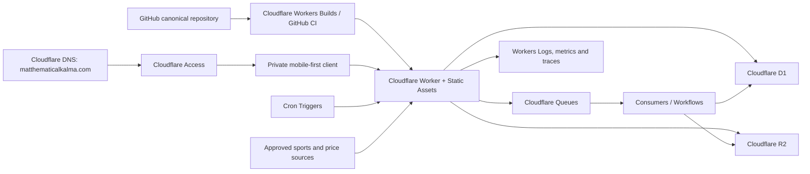
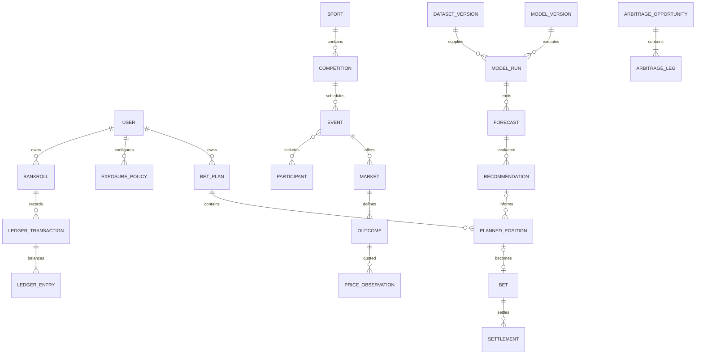

# Canonical MVP architecture

Status: accepted for MVP foundation; Cloudflare platform revision accepted (2026-08-27)

Matthematical Kalma is a private, mobile-first sports-market intelligence and disciplined bankroll-management product. It is independent decision support: it does not place bets, store bookmaker credentials, operate an online in-play workflow, or publish tips. The MVP is one Vinext application and Cloudflare Worker, organised as a modular monolith.

This is the canonical MVP architecture and data/audit contract. Focused decisions in [docs/adr](adr/README.md) are normative where they add detail.

## 1. System boundary and modules

The server is the trust boundary. Browser storage may hold temporary UI drafts and device presentation preferences, never authoritative identity, bankroll, limits, bets, recommendations, or audit history. Raw provider payloads remain separate from canonical records. Demo fixtures are test/development assets only and never production runtime state.

| Module | Owns | Excludes |
| --- | --- | --- |
| Identity & preferences | Internal users, identity mappings, settings, export/deletion state | Authentication secrets and bookmaker credentials |
| Sports catalogue | Sports, competitions, participants, aliases, events, results | Provider-specific UI models |
| Market data | Operators, rulesets, markets, outcomes, timestamped prices | Forecasts and personal positions |
| Data & modelling | Sources, dataset/model versions, runs, forecasts | Stake sizing |
| Recommendation | Baselines, Bet/Watch/Pass, explanations, audit bundles | Mutation of published decisions |
| Bankroll & risk | Bankrolls, reconciled ledger, limits, exposure evaluations, responsible-use events | Results and forecasts |
| Bet Plan & bets | Plans, positions, manual bet records and user actions | Automatic placement |
| Settlement | Result revisions, settlement, void and correction events | Destructive history edits |
| Evaluation | Performance, closing-line value and calibration | Authoritative balances |
| Arbitrage | Scan observations, immutable opportunity snapshots and legs | Predictive value or execution |
| Audit & operations | Provenance, idempotency receipts, jobs, exports and deletion tombstones | Duplicated domain decisions |

Modules expose typed commands, queries and domain events. A module cannot update another module’s tables directly. Cross-module writes use an application service and one D1 transaction or an explicitly recorded compensating workflow.

## 2. Runtime responsibilities

### Frontend

- Preserve the established 375px-first, blue/yellow, compact information hierarchy without imitating a bookmaker.
- Request typed server APIs; never authoritatively calculate balance, exposure eligibility, settlement return, or recommendation state.
- Display source time, freshness, uncertainty, constraints and Pass prominently.
- Send a client request ID/idempotency key for retriable writes.
- Keep paper mode the default; preserve cooling-off, loss/exposure caps, Pass, uncertainty, help links and warnings as functional controls rather than footer copy.
- Remain pre-match and manual-execution only. Product/legal review must confirm the obligations applicable to an independent decision-support tool before any real-money tracking release; the app must not imply it is a licensed wagering provider.

### Backend

- Require Cloudflare Access on production and preview routes. Use validated Worker Access context (or validate JWT signature, issuer, audience and expiry) and map the stable Access `(issuer, subject)` to an internal user.
- Apply owner scoping before repository access.
- Validate commands, coordinate modules and commit related changes atomically.
- Create immutable recommendation, ledger, settlement and provenance facts.
- Return explicit empty, stale, unavailable, forbidden and conflict states.

### Persistence and background work

Cloudflare-managed D1 is the MVP system of record. Development, staging and production use separate databases and bindings. Foreign keys are enabled; constraints enforce ownership, uniqueness, ranges and simple state rules. Subject to `intelligence-retention/1`, R2 may store rights-permitted retained raw source artifacts, model/dataset bundles and generated exports; D1 stores only the corresponding rights-permitted owner, object key, checksum, type, size, source and lifecycle metadata. Future private uploads follow their separate user-owned policy. Compiled application assets are served by Workers Static Assets, not copied into R2.

Cron Triggers initiate short periodic polling and maintenance in UTC. Queues buffer, batch and retry independent ingestion/normalisation messages with at-least-once delivery. Workflows coordinate durable multi-step model, export, settlement-reconciliation and retention processes. Jobs use leases, checkpoints, idempotency keys, bounded retries and observable run records. They call the same application services and cannot bypass audit or ownership rules.

## 3. Universal record conventions

Canonical records use opaque UUIDv7-style IDs, UTC `created_at`, and—when editable—UTC `updated_at` plus integer `version`. Foreign IDs are never primary keys. Material state changes use events/revisions, not destructive replacement.

Ownership classes:

- **Shared reference:** sports, events, operators, prices, datasets, models and aggregate model evaluation.
- **User-owned:** preferences, bankrolls, limits, plans, bets, notes, personal recommendations/performance and exports. Every root and child is transitively owned by exactly one internal user.
- **System audit:** provenance, runs, recommendation bundles, corrections, jobs and idempotency receipts. Service-written; may be user-scoped.

### Users and preferences

| Record | Definition / relationships | Owner | Lifecycle |
| --- | --- | --- | --- |
| `users` | Internal subject with status, locale, display timezone and deletion state; no auth secret | User | provisioned → active → suspended/deletion_pending → deleted tombstone |
| `user_identities` | Unique `(issuer, subject)` Cloudflare Access mapping; email is allowlist/contact metadata, not ownership authority | User | linked → revoked/replaced |
| `user_preferences` | Preferred sports, competitions, markets, operators and display choices | User | editable with optimistic concurrency; material change history |

### Bankroll, ledger and controls

| Record | Definition / relationships | Owner | Lifecycle |
| --- | --- | --- | --- |
| `bankrolls` | Paper or optional manual-real-money account with currency; MVP allows one active paper bankroll per user. Balance is derived | User | draft → active → closed |
| `ledger_transactions` | Atomic business transaction with type, effective time, idempotency key, reason/source and reversal link | User | posted once; corrected by reversal/replacement |
| `ledger_entries` | Signed integer-minor-unit postings in one transaction across clearing/equity/stake/return/fee categories | User | immutable |
| `exposure_policies` | Versioned limits for bet, event, sport, day/week, loss/drawdown, mode and cooling-off | User | draft → active → superseded |
| `exposure_evaluations` | Policy version + bankroll/open-exposure snapshot + deterministic result/reasons | User | immutable per sizing decision |
| `responsible_use_events` | Cooling-off, real-money disablement, warnings, acknowledgements and limit effective times | User | append-only |

Ledger invariants:

- Money changes only through balanced transaction groups; signed entries sum to zero.
- Deposit, withdrawal, stake reservation/release, return, fee and adjustment are distinct types.
- Correction posts equal-and-opposite entries against the original before corrected entries.
- Cached balances are disposable and must reconcile to the immutable ledger.

### Sports and market reference data

| Record | Definition / relationships | Owner | Lifecycle |
| --- | --- | --- | --- |
| `sports` | Canonical sport code and rules family | Shared | active → retired |
| `competitions` | League/tour within a sport, canonical timezone and season scheme | Shared | active → retired |
| `participants` | Provider-independent team/player/fighter | Shared | provisional → verified → merged/retired |
| `participant_aliases` | Provider-scoped ID/name mapping, confidence and reviewer | Shared | proposed → verified/rejected/superseded |
| `events` | Competition contest, scheduled start, status, venue and identity confidence | Shared | scheduled → postponed/cancelled/started → completed; corrected by revision |
| `event_participants` | Participant role/order for one event revision | Shared | immutable when revision published |
| `event_results` | Versioned sourced result fact, distinct from personal settlement | Shared | proposed → confirmed → corrected/voided by later revision |
| `operators` | Bookmaker/exchange identity and jurisdiction | Shared | active → suspended/retired |
| `operator_rulesets` | Effective-dated commission and settlement rules | Shared | superseded, never overwritten |
| `markets` | Event market using a versioned definition; MVP is pre-match | Shared | open → suspended/closed → settled/void |
| `outcomes` | Exhaustive mutually exclusive selections and canonical line/handicap | Shared | published → settled/void |
| `price_observations` | Operator/outcome decimal quote, availability, known limits/liquidity, provider observation and receipt times | Shared | append-only |

### Data, models, forecasts and recommendations

| Record | Definition / relationships | Owner | Lifecycle |
| --- | --- | --- | --- |
| `data_sources` | Provider/manual identity, terms/version and reliability class | Shared | configured → active → retired |
| `source_artifacts` | Rights-permitted source locator, retrieval metadata, SHA-256, schema version and optional redacted payload/blob reference | System | immutable while permitted; bytes, metadata, locator and hash follow the active rights disposition and may all expire/delete |
| `dataset_versions` | Source-artifact/transform manifest, data cutoff, feature schema and content hash | Shared | building → sealed → deprecated |
| `model_versions` | Algorithm/config/code ID, scope, training dataset and evaluation state | Shared | candidate → approved → retired; approved version immutable |
| `model_runs` | Model/dataset/code versions, parameters, seed, input hash, timestamps and status | System | queued → running → succeeded/failed/cancelled |
| `forecasts` | Per-outcome probability, uncertainty, feature-as-of and evaluation cohort | Shared | emitted once; invalidation appends |
| `market_baselines` | De-vig method, exact eligible price IDs, consensus probabilities and as-of time | Shared | immutable snapshot |
| `recommendations` | Bet/Watch/Pass for forecast/outcome/price with rules, edge, fair odds, confidence and reasons; personal decisions also reference owner and exposure evaluation | System/user-scoped | published → expired/ineligible/withdrawn by event; payload immutable |
| `recommendation_events` | Publication, view, accept, change, ignore, expiry and invalidation | System/user | append-only |

Every published recommendation freezes: forecast; all mutually exclusive probabilities; run/model/dataset/input manifest; baseline and exact price IDs; event/market revisions; decision-rule version; code revision; timestamps; reason codes; and, when personal, ledger/exposure cutoff, policy version and exposure evaluation. It has a canonical content hash.

### Bet Plans, bets and settlement

| Record | Definition / relationships | Owner | Lifecycle |
| --- | --- | --- | --- |
| `bet_plans` | Deliberate collection of proposed positions for one bankroll | User | draft → confirmed/abandoned/expired |
| `planned_positions` | Outcome, optional recommendation, target operator/price/stake, governed max, correlation group and exposure evaluation | User | editable draft → confirmed/removed/expired; revisions kept |
| `bets` | Manual record of paper or externally placed position with actual odds, stake, time and operator | User | open → settlement_pending → settled/void; corrected by events |
| `bet_events` | Created, confirmed, note/tag, settlement proposal, settlement, void, reversal and correction | User/system | append-only |
| `settlements` | Calculation against one result/ruleset: status, gross return, fees, net return and ledger transaction | User | proposed → posted; superseded by reversal + corrected settlement |

A manual bet may lack a recommendation but must use `entry_source = manual_external` and is excluded from model-following cohorts. A recommendation-derived bet freezes recommended and actual values separately.

### Evaluation and arbitrage

| Record | Definition / relationships | Owner | Lifecycle |
| --- | --- | --- | --- |
| `closing_price_records` | Defined closing observation/baseline and capture policy | Shared | pending → captured/unavailable; corrections append |
| `performance_records` | Versioned cohort metric: P/L, ROI, drawdown, scoring and sample size | Shared/user | rebuildable derived record; never money authority |
| `clv_records` | Recommendation/bet price versus versioned closing benchmark | Shared/user | derived; recalculation creates new version |
| `calibration_records` | Forecast cohort/bin, predicted and observed rates, scores and sample size | Shared | derived/versioned |
| `arbitrage_observations` | One scan over an equivalence group, considered prices and rejection reasons | Shared | append-only |
| `arbitrage_opportunities` | Qualified kind, implied sum, fees, return, freshness cutoff, expiry and completeness | Shared | observed → revalidated/expired/rejected; snapshot immutable |
| `arbitrage_legs` | Outcome/operator/price ID, stake allocation, commission, limits/liquidity and rounding | Shared | immutable child |

## 4. Relationships and aggregate boundaries

Aggregate boundaries are User/identity, Bankroll transaction, Exposure policy, Event revision, Market/outcomes, Dataset version, Model run/forecasts, Recommendation audit bundle, Bet Plan, Bet/settlement and Arbitrage snapshot. Historical consumers pin IDs and versions; they never follow a mutable “latest” pointer during replay.

## 5. Immutable versus editable

Immutable after publication/posting: source artifacts and price observations; sealed datasets; approved model versions; completed runs and forecasts; published recommendations and inputs; ledger postings; bet/settlement/correction events; result revisions; closing captures; exposure evaluations; arbitrage snapshots; audit events and idempotency receipts.

Editable with version/conflict checks: profile display data, ordinary preferences, draft Plans/positions, notes/tags (with history where material), provisional mappings, and future exposure limits subject to responsible-use rules.

User-visible removal becomes archive, redaction, withdrawal or appended reversal. Physical erasure occurs only through the privacy deletion workflow, leaving non-identifying completion/reconciliation evidence where necessary.

## 6. Recommendation reproduction

An authorised audit query by `recommendation_id` returns:

1. Immutable payload and canonical hash.
2. Exact event, market, outcome, operator and price revisions.
3. Forecast and all outcome probabilities.
4. Model version, code revision, parameters, seed and run environment.
5. Dataset/input manifest, feature schema, source hashes and cutoff.
6. De-vig/baseline method and included/excluded price IDs.
7. Decision-rule version, thresholds, uncertainty and quality gates.
8. For personal output: owner, ledger cutoff, open exposure, policy version and evaluation.
9. Fair odds, edge, EV, suggested stake and reason codes.
10. Observed, received, effective, created, published and expiry times.

**Verification replay** recomputes from retained canonical inputs within a declared tolerance. **Forensic replay** additionally uses the original executable/model artifact. Every provider-derived replay component—including raw bytes, checksums, extracted fields and locators—is retained only when its current rights schedule and `intelligence-retention/1` disposition permit it. If a required component is prohibited, expired or deleted, replay is explicitly unavailable or limited; the system retains only the non-content limitation/deletion evidence that the same schedule permits.

Recommendations may be invalidated, expired or withdrawn, never edited silently. Corrections reference the original, actor/source, reason, time and a new content hash.

## 7. Idempotency, deduplication and provenance

- Retriable commands require `Idempotency-Key`, scoped by authenticated user + command, with request hash, response reference and expiry. Reuse with a different request conflicts.
- Provider ingestion keys stable records by `(source, type, source_id, source_version/observed_at)` when those fields are permitted; absent permitted stable IDs or hashes, ingestion must use an approved non-provider fixture identity or fail closed rather than invent durable provider-derived identity.
- Price uniqueness uses permitted source quote ID or permitted canonical fields/hash under the active rights schedule. Same-price observations at different source times remain valid when their required retained identity is permitted; otherwise the observation is not persisted.
- Event matching uses sport, competition, participants, start tolerance and venue. Ambiguity is quarantined, never guessed.
- Dataset/input/recommendation bundles use deterministic canonical JSON + SHA-256 only when every provider-derived input and retained digest is permitted by its rights schedule; otherwise the bundle is not sealed/persisted or is rebuilt from permitted inputs.
- Imported facts store only rights-permitted source/provider time, receipt time, adapter/schema version, quality, artifact hash, ingestion run and correction chain. Missing mandatory semantic evidence fails closed; deletion can intentionally make replay unavailable.
- Delivery is at-least-once; unique constraints and receipts make domain effects exactly-once.

## 8. Time and freshness

- Persist instants as UTC ISO-8601 text with milliseconds. Reject offset-free datetimes.
- Store user display and competition/event IANA timezones separately; never use abbreviations as authority.
- Distinguish `source_observed_at`, `received_at`, `effective_at`, `created_at`, `published_at`, `event_start_at`, `settled_at` and `corrected_at`.
- Provider observation time and receipt time are never substituted for each other; skew/late delivery creates quality flags.
- Versioned policies define quote-age limits by sport/market/operator/use. The applied policy and evaluated freshness are frozen with each decision.
- No actionable recommendation publishes at/after canonical start. An earlier start-time correction invalidates affected recommendations without deleting them.
- Pre-match markets close at the earliest of confirmed start, provider suspension or safety cutoff. Late prices remain audit facts but are ineligible.
- Closing price follows a versioned rule, not ad hoc “latest.”

## 9. Money, odds and probability precision

- Money is signed 64-bit integer minor units plus ISO 4217 currency. MVP bankrolls are single-currency. Binary floating point never posts/reconciles money.
- Decimal odds enter as canonical strings and store at scale 1e-6 (`decimal_odds_micros`), greater than 1.000000. Retain the provider string in provenance.
- Probabilities store at scale 1e-9 (`probability_nanos`), inclusive 0–1; mutually exclusive outcomes meet a declared sum tolerance.
- Edge, Kelly, commission, ROI and CLV use signed 1e-9 scale or exact rational inputs.
- Server calculations use exact decimal/integer arithmetic and versioned rounding. Money defaults to half-even minor-unit rounding unless an operator ruleset says otherwise.
- APIs return authoritative decimal strings plus scale, not IEEE-754 JSON numbers. UI rounding is presentation only.

## 10. Isolation, privacy, export and deletion

- Cloudflare Access authenticates through an exact-email allow policy; the Worker accepts only validated Access context and maps trusted `(iss, sub)` to internal `users.id`. Email is not the ownership key.
- Access controls admission to production and previews. Application authorization separately scopes every personal query/command by `owner_user_id`; client owner IDs are ignored.
- Repository APIs require `OwnerContext`. System jobs require an explicit service capability and audit reason.
- Composite ownership checks ensure children share the parent owner. Opaque IDs are not security.
- Logs/traces omit email, notes, raw payloads, balances/stakes and tokens; use pseudonymous IDs.
- Export creates a versioned machine-readable package of profile, preferences, policies, plans, bets, ledger, settlements and personal audit references with checksums/times.
- Deletion is authenticated, confirmed, asynchronous and resumable: freeze writes; optional export; revoke access; delete/anonymise user data in dependency order; retain only required non-identifying tombstones/shared facts; verify completion. Backups expire per retention.
- Shared market/model facts survive a user deletion. Personalised recommendation/exposure links are erased or irreversibly anonymised.

Step 2 must prove owner isolation with two synthetic test subjects before beta admission. Matthew is not an initial identity or a Step 2 prerequisite; when admitted later, he receives a distinct Access subject and internal user and never shares administrator data.

### Selected authentication approach

**Selected for the private MVP:** Cloudflare Access protecting the Worker, with One-Time PIN and an exact-email allow policy initially containing only `Admin@matthematicalkalma.com` (email comparison normalised case-insensitively). Configure the global, application and policy session durations to **one month**, the longest currently supported practical duration, rather than attempting an unlimited session. Use Worker-native Access context where available; otherwise validate the Access application JWT signature, issuer, audience, expiry and subject. Store a unique `(issuer, subject)` identity mapping and provision each permitted person into a different internal user row. Do not use a domain-wide allow rule, Cloudflare-account membership, a shared email, or email alone as record ownership.

Alternatives considered:

- **External managed auth (Clerk, Auth0 or WorkOS):** suitable when public self-service accounts, passkeys, recovery and richer lifecycle management are required. Deferred because the private two-user MVP does not need an app-owned login surface and would add another security/data processor.
- **Custom magic-link/passkey auth in the Worker:** rejected for MVP because token issuance, credential recovery, abuse protection and session security would become application responsibilities.
- **Cloudflare account membership:** rejected as product identity because it couples application users to infrastructure administrators and cannot represent later beta users as ordinary isolated product users cleanly.
- **Access with a whole-domain allow rule:** rejected; only exact identities are admitted.

Identity implementation is deliberately not started while infrastructure readiness is incomplete. Administrator email verification, 2FA/recovery and production-domain migration are complete. The remaining gates are Access team domain/application/audience confirmation, administrator One-Time PIN delivery, protected non-production deployment configuration and a non-production Worker deployment. Matthew’s later admission is not a gate.

## 11. Initial APIs and services

Version initial HTTP APIs under `/api/v1`. Routes call application services; services call module repositories.

| Boundary | Commands / queries |
| --- | --- |
| Session/profile | `GET /me`, preferences, export/delete status |
| Catalogue | sports, competitions, events and analysis |
| Markets | outcome prices/history with freshness and quality |
| Forecasts | detail and immutable audit view |
| Recommendations | ranked feed, detail and action events; published payload read-only |
| Bankroll | paper bankroll, balance/ledger, idempotent adjustment |
| Risk | policy versions, exposure and deterministic evaluation |
| Bet Plan | create/edit/confirm/abandon with optimistic version |
| Bets | manual record, notes/tags, settle/void/correct commands |
| Evaluation | personal performance/CLV and shared calibration |
| Arbitrage | pre-match observations/opportunities, read-only MVP |
| Admin ingestion | service-only imports, mapping review and jobs |

Errors have stable codes and request IDs. Commands include schema version, idempotency key where retriable and expected record version where editable. History/feed endpoints use cursor pagination. Transactional outbox events (`PriceObserved`, `ForecastPublished`, `RecommendationPublished`, `BetRecorded`, `SettlementPosted`, `LimitChanged`) support background consumers without committing to a broker.

## 12. Migrations, testing and observability

### Migrations

- Ordered immutable SQL migrations live in source; never edit an applied migration.
- Prefer additive expand/contract. Destructive changes need backup/export verification, data migration, forward-fix plan and approval.
- The approved Worker and D1 names are `matthematical-kalma-dev`, `matthematical-kalma-staging` and `matthematical-kalma-production`; each uses the `DB` binding and a separate migration history. Migrations are versioned SQL in GitHub, applied by database name in a gated deployment job, and production verifies foreign keys, schema readability and domain reconciliation. Full file-level integrity checks use an approved export procedure because D1 rejects `PRAGMA integrity_check` through its SQL authorizer.
- Before a production schema change, record a D1 Time Travel bookmark; use periodic D1 export to private R2 only when retention beyond the platform recovery window is required and every included provider-derived class is expressly permitted for that export and duration.
- Backfills are resumable/idempotent with progress and reconciliation.
- Seed only deterministic reference/test data in local/test. Production starts with genuine empty user state and has no demo import path.

### Tests

- Unit/property: odds, de-vig, Kelly caps, integer money, ledger balancing, settlement, CLV, calibration, freshness and timezone edges.
- Schema/contract: constraints, state rules, serialization/hashes and API compatibility.
- Repository integration against SQLite/D1 semantics with foreign keys.
- Isolation: every personal read/write, guessed ID, pagination, aggregates, jobs, export/deletion using two users.
- Golden replay: fixed inputs reproduce recommendation/hash; invalidation preserves original.
- Ingestion: duplicates, reordering, late quotes, alias ambiguity, corrections and schema drift.
- End-to-end: empty onboarding → bankroll → governed plan → manual bet → settlement → reversal/reconciliation.

### Observability

- Structured logs: request/job/run ID, module, operation, duration, outcome, pseudonymous actor/source.
- Metrics: request errors/latency, job lag/retries, coverage, duplicates/quarantine, price age, recommendation states, settlement lag, ledger imbalance (always zero), replay mismatch, isolation denial and privacy workflow progress.
- Traces: receipt → canonical record → run → forecast → recommendation → plan/bet → settlement/evaluation.
- Alerts: missing/ambiguous mappings, start changes, stale prices, probability-sum violations, result conflict and missed closing capture.
- Domain audit evidence and short-lived diagnostic logs have separate retention.

## 13. Cloudflare migration and production topology

| Existing Sites capability | Cloudflare target | Migration implication |
| --- | --- | --- |
| Sites hosting | **Cloudflare Worker with Workers Static Assets** | Preserve the Vinext build only if its output is directly deployable; otherwise adopt the supported Cloudflare Vite/OpenNext adapter in a dedicated platform migration before feature work. Do not choose Pages for the new production target. |
| Sites-managed D1 (not yet bound) | **Cloudflare D1** | No production data transfer exists. Create separate dev/staging/prod databases and committed migrations; bind `DB` per environment. |
| Sites identity | **Cloudflare Access** | No identity rows exist to migrate. Initially admit only `Admin@matthematicalkalma.com`; create internal `users` and `user_identities(issuer, subject)` in Step 2. Add Matthew later as a separate beta identity. |
| Sites static assets | **Workers Static Assets** | Build-generated JS/CSS/images deploy atomically with the Worker. |
| Future uploads/artifacts | **Private R2** | Create only when Step 2/ingestion needs it. Use Worker bindings; keep metadata/checksums/ownership in D1 and deny public buckets for personal data. |
| Sites background capability | **Cron + Queues + Workflows** | Cron starts schedules; Queues buffer independent jobs; Workflows own durable dependent steps. Retain domain idempotency because Queue delivery is at least once. |
| Sites runtime values | **Wrangler bindings, vars and secrets** | Commit non-secret binding declarations/config; set environment-specific secrets through Cloudflare encrypted secrets. Never commit tokens or provider keys. |
| Sites live URL | **`https://matthematicalkalma.com`** | Migration complete: the apex is a protected Worker Custom Domain and `www` permanently preserves path/query while redirecting to the apex. Microsoft 365 DNS and mail flow were revalidated. Keep the old Site only for the bounded rollback review window. |
| Sites source publication | **GitHub → Workers Builds or GitHub Actions → Wrangler** | GitHub remains canonical. Require checks on pull requests; deploy preview/staging from non-production refs and production from protected `main` with a scoped Cloudflare API token and gated D1 migration job. |

Cloudflare account administration uses the verified `cloudflare@matthematicalkalma.com` alias with authenticator MFA, retained recovery codes and least-privilege API tokens. `Admin@matthematicalkalma.com` remains the initial Cloudflare Access application identity; infrastructure administration is never an application-user role. The superseded Cloudflare account stays untouched during the rollback window and is not a valid target for new resources or credentials. Account identifiers and deployment credentials belong only in protected Matthematical Kalma GitHub environment configuration, never source or Notion. Repository, Wrangler configuration, migrations and deployment workflow stay in [OnlyPlantsClub/Matthematical-Kalma](https://github.com/OnlyPlantsClub/Matthematical-Kalma); Notion records decisions and delivery status only.

Production service map:

- **DNS/TLS/WAF:** Cloudflare authoritative DNS for `matthematicalkalma.com`, managed TLS, baseline WAF/rate limiting and Access.
- **Web/API:** one Worker modular monolith serving SSR/API plus Workers Static Assets.
- **Relational state:** D1 bindings per environment.
- **Objects:** private R2 buckets per environment for source artifacts, exports and later uploads.
- **Async:** Cron Triggers → producer/application service → Queues; Workflows for durable dependent steps.
- **Configuration:** `wrangler.jsonc` and generated binding types in GitHub; encrypted secrets per environment.
- **Delivery:** protected GitHub `main`, required checks, preview/staging, migration gate, then Worker deploy/custom-domain promotion.
- **Operations:** Workers structured logs/traces, queue/workflow run records, D1 integrity/reconciliation metrics and alerting.

## 14. Now versus deferred

Decided now:

- Cloudflare Worker with Workers Static Assets as the production modular monolith; Pages is not the target.
- Cloudflare-managed D1 relational authority and private R2 for retained artifacts/exports/uploads.
- Cloudflare Access with a single initial administrator allow rule, one-month session duration, validated Access issuer/subject mapping and mandatory server owner scoping; later beta users are admitted individually.
- `matthematicalkalma.com` is the live protected Worker Custom Domain; `www` permanently redirects to the apex with path/query preservation. Microsoft MX, SPF, DMARC, verification and autodiscover are verified and post-cutover mail tests passed.
- Worker/D1 environment names are `matthematical-kalma-dev`, `matthematical-kalma-staging` and `matthematical-kalma-production`.
- GitHub as canonical source with GitHub-based CI/CD to Cloudflare.
- Cron Triggers, Queues and Workflows selected by job shape.
- Append-only observations, forecasts, recommendations, ledger, settlements and corrections.
- Ledger-derived balances and balanced transactions.
- UTC instants, IANA zones, explicit freshness/pre-start policy.
- Integer/scaled values and versioned rounding.
- Provider-neutral records, rights-conditioned provenance/hashes and idempotent writes under `intelligence-retention/1`.
- No production demo runtime state.

Safely deferred:

- Provider selection and provider-specific acquisition, licensing, class-by-class retention, derived/model survival and deletion rights. The governing `intelligence-retention/1` policy and authenticated rehydration architecture are decided in ADR-0015/0016.
- External public/self-service auth after the private MVP, if Access no longer fits.
- Paper-only versus optional manual real-money (supported by `bankroll.kind`).
- ATP/WTA scope, AFL second market, operator coverage and model algorithms.
- Arbitrage MVP versus parallel beta.
- Exact R2 retention, Workflow boundaries, notifications, warehouse and service extraction.
- Shared workspaces, which require explicit future workspace/roles and never weaken `owner_user_id`.

Provider selection and Matthew’s beta admission do not block Step 2. The Cloudflare foundation, protected deployment pipeline, Access admission and production-domain cutover are complete. Step 2 remains not started and must implement internal identity mapping, server owner scoping and synthetic two-subject isolation without treating platform admission as application authorization.

### Cloudflare deployment and migration pathway

GitHub is the canonical source and deployment origin. `OnlyPlantsClub/Matthematical-Kalma` deploys through GitHub Actions using Wrangler; Cloudflare dashboard edits are for bootstrap or incident recovery and must be reconciled back to source.

| Concern | Cloudflare service | MVP rule |
| --- | --- | --- |
| Web runtime | Worker with Static Assets | One Vinext build and Worker; no Pages split |
| Relational state | D1 binding | Separate local, preview/staging and production databases and migration histories |
| Private identity | Cloudflare Access | Verify Access JWT server-side; map issuer/subject, never trust email or client owner IDs |
| Domain and TLS | Cloudflare authoritative DNS | `matthematicalkalma.com` is active; Microsoft MX, SPF and autodiscover are verified |
| Scheduled work | Cron Triggers | Small periodic orchestration only; invoke audited application services |
| Async ingestion | Queues | Add when provider ingestion needs retry/back-pressure; not required for the first vertical slice |
| Long-running processes | Workflows | Deferred until model/import jobs exceed ordinary Worker execution patterns |
| Artifacts/exports | R2 | Deferred until blob needs exist; D1 retains ownership and integrity metadata |
| Secrets | Wrangler secrets/bindings | Never in Git, client bundles, logs or Notion |
| Delivery | GitHub Actions + Wrangler | Build, typecheck, lint, test, migrate staging, deploy, smoke-test; production migration/deploy is gated |

Migration sequence:

1. **Complete:** activate Cloudflare authoritative DNS for `matthematicalkalma.com`; Microsoft has verified MX, SPF and autodiscover and reports email ready.
2. **Complete:** Cloudflare administrator alias verification, authenticator 2FA and recovery-code capture are confirmed; inbound/outbound mail and alias delivery tests passed.
3. **Complete:** commit the Worker Static Assets configuration, approved environment/D1 binding names, ordered migrations and non-deploying CI checks.
4. **Complete:** development, staging and production resources, Access and protected GitHub environments are configured; manual fail-closed deployments and administrator OTP acceptance passed.
5. Implement `/api/v1/me`, identity mapping and owner-scoped repositories; use two synthetic subjects to prove the isolation matrix before personal features.
6. Admit Matthew later by adding his exact address to Access, signing in once to obtain a distinct subject and provisioning a distinct internal user. Run the isolation regression suite before granting beta access.
7. **Complete:** production resources, protected credentials, migration/deployment workflow, apex Custom Domain and `www` redirect passed their explicit approval gates. The Sites deployment is superseded and retained temporarily for rollback review.

This pathway supersedes Sites hosting and Sites/SIWC identity assumptions. ADR-0001 and ADR-0002 remain as historical records and are superseded by ADR-0005 and ADR-0006.

### Revised Step 2 prerequisites

1. **Complete:** Cloudflare administrator email verification, authenticator 2FA and recovery-code capture are confirmed.
2. **Complete:** `matthematicalkalma.com` is active on the replacement Cloudflare authoritative zone; Microsoft MX, SPF, DMARC, domain verification and autodiscover resolve correctly, and inbound/outbound mail tests passed.
3. **Complete:** protected development, staging and production GitHub environments deploy the Worker/Static Assets configuration with separate scoped credentials and exact resource allowlists.
4. **Complete:** Worker/D1 names are approved: `matthematical-kalma-dev`, `matthematical-kalma-staging`, `matthematical-kalma-production`, all with binding `DB`.
5. **Complete (platform admission):** Access protects development, staging, the production Worker destination, apex and `www`; One-Time PIN, exact administrator admission and one-month sessions were verified. Step 2 still implements and tests application identity/authorization.
6. **Prepared:** ordered D1 migration/runbook covers forward-only migrations, Time Travel bookmark, foreign-key/schema-read checks, export integrity verification when required and forward fixes.
7. **Complete:** CI and protected manual deployment workflows require typecheck, lint, tests, build, migration review, secret scanning, exact environment/resource guards and reviewer gates.
8. **Step 2 acceptance, not an infrastructure prerequisite:** synthetic distinct Access subjects map to distinct internal users and all negative/isolation cases fail closed. Matthew is admitted later and repeats this regression suite.
9. Australian responsible-gambling copy/control requirements remain product acceptance criteria and are not delegated to the platform.

## Step 1 acceptance map

- Every core record has definition, owner and lifecycle.
- Personal roots have one owner and enforced transitive ownership.
- Money reconciles through immutable balanced entries.
- Forecast/recommendation bundles freeze source, model, data, code, time and policy.
- Recommendations, settlement, void and correction history cannot be silently rewritten.
- Demo fixtures are test/development-only.
- Step 2 can implement identity mapping and owner-scoped repositories without revisiting the model.

## Official platform and regulatory references

- [Cloudflare Workers best practices and Static Assets](https://developers.cloudflare.com/workers/best-practices/workers-best-practices/)
- [Full-stack applications on Workers](https://developers.cloudflare.com/workers/static-assets/routing/full-stack-application/)
- [Cloudflare Access for Workers](https://developers.cloudflare.com/workers/configuration/cloudflare-access/)
- [Cloudflare Access application token](https://developers.cloudflare.com/cloudflare-one/access-controls/applications/http-apps/authorization-cookie/application-token/)
- [Cloudflare Access One-Time PIN](https://developers.cloudflare.com/cloudflare-one/integrations/identity-providers/one-time-pin/)
- [Cloudflare Access session management](https://developers.cloudflare.com/cloudflare-one/access-controls/access-settings/session-management/)
- [Cloudflare D1 migrations](https://developers.cloudflare.com/d1/reference/migrations/)
- [D1 Time Travel](https://developers.cloudflare.com/d1/reference/time-travel/)
- [Workers Git integration](https://developers.cloudflare.com/workers/ci-cd/builds/git-integration/)
- [Cron Triggers](https://developers.cloudflare.com/workers/configuration/cron-triggers/)
- [Workers secrets](https://developers.cloudflare.com/workers/configuration/secrets/)
- [ACMA — Interactive Gambling Act](https://www.acma.gov.au/interactivegambling)
- [ACMA — BetStop](https://www.acma.gov.au/betstop-national-self-exclusion-registertm)
