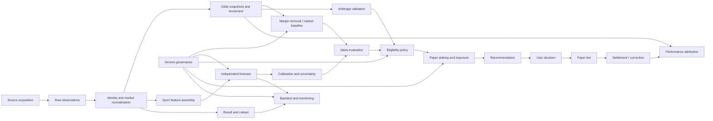

# Intelligence engine architecture

Status: proposed architecture; documentation only (2026-08-28)

This document defines the intelligence boundary for Matthematical Kalma. It refines, but does not replace, the accepted platform boundaries in [ARCHITECTURE.md](ARCHITECTURE.md). No model, source, schema, API, job, staking rule, or provider is implemented or approved by this document. Statements labelled **Decision** are architectural constraints accepted by the accompanying ADRs. Statements labelled **Proposal** require implementation evidence or product approval.

## 1. Purpose and non-goals

The engine independently estimates pre-match outcome probabilities, compares them with observed bookmaker prices, identifies candidate value and arbitrage, and proposes fiscally controlled **paper** positions. Its purpose is decision support and honest evaluation, not wager execution.

**Decisions**

- Paper betting is the only engine-controlled mode. The engine never logs in to a bookmaker, holds bookmaker credentials, places or confirms a wager, or claims a guaranteed return.
- AFL, MMA and boxing are the first modelling families. A future sport enters only through a versioned plug-in contract and sport-specific validation.
- Observations, derivations, forecasts, recommendations, user decisions, paper bets, results and settlements remain separate facts.
- Every published recommendation is reproducible from versioned inputs, code/model/policy identifiers and source provenance.
- Stale, incomplete, ambiguous, suspended, post-start or materially corrected inputs fail closed to `pass`/`ineligible`.

Out of scope: live/in-play operation, automated wager placement, bookmaker account integration, production schemas/APIs/jobs, infrastructure, authentication, deployment, existing migrations, paid-provider selection and real-money bankroll operation.

## 2. Capability map



| Capability | Owns | Required output / failure behaviour |
| --- | --- | --- |
| Source acquisition | authorised retrieval/manual import, receipt metadata, raw-artifact hash | immutable source envelope; quarantine when licence, identity, timestamp or integrity is unclear |
| Normalisation | canonical sport, competition, event, participant, market, outcome, line and ruleset identity | versioned mapping with confidence; never guess ambiguous matches |
| Odds history | append-only quotes and coherent as-of snapshots | source/observed/received times, availability, currency, limits/liquidity if known; explicit gaps and staleness |
| Margin removal | implied probabilities, overround, de-vig distribution and consensus baseline | method/version and exact input quote IDs; no universal claim that a de-vig method is “truth” |
| Forecasting | probabilities independent of the offered target price at inference time | exhaustive distribution, uncertainty, as-of cutoff, model/data/code versions and applicability scope |
| Calibration/backtesting | time-respecting evaluation against outcomes and baselines | Brier/log loss, reliability, uncertainty intervals, sample sizes, drift and cohort results |
| Value detection | forecast-versus-price EV and edge | candidate plus sensitivity and rejection reasons; positive EV alone is insufficient |
| Arbitrage detection | complete mutually exclusive outcome coverage across executable quotes | post-cost return and leg allocations, or rejected reason; revalidate immediately before display/use |
| Eligibility | quality, freshness, model, regulatory/product and risk gates | deterministic `eligible`, `watch`, `pass` or `unavailable` with policy version/reason codes |
| Paper staking | bankroll, uncertainty, caps, correlations and aggregate exposure | zero or capped paper stake; deterministic rounding and residual policy |
| Settlement | sourced result + operator ruleset applied to a paper bet | proposed/posted settlement; correction by reversal and replacement, never overwrite |
| Attribution | forecast, selection, sizing, price, execution proxy and result contributions | versioned cohort metrics; separates model quality from price selection and staking variance |
| Governance | dataset/model/policy registry, approvals, retirement and rollback | immutable approved artifact; challenger cannot silently replace champion |

## 3. Fact separation and lineage

The engine must not collapse semantically different numbers into an “opportunity” row.

| Layer | Meaning | May depend on | Must not be rewritten as |
| --- | --- | --- | --- |
| Observed bookmaker data | what a named source reported at a stated time | source payload and mapping | fair probability or model belief |
| Derived fair probability | deterministic transformation of one coherent market snapshot | observed prices, de-vig method | independent forecast |
| Model forecast | engine belief produced without target offered odds as a prediction feature | permissible as-of sport data; optionally separate market-informed benchmark model | recommendation |
| Recommendation | policy evaluation of forecast, price, uncertainty, freshness and exposure | immutable forecast/snapshot/policies | user intent or bet |
| User decision | accept, reject, alter, defer or ignore | recommendation or manual entry | recommendation outcome |
| Paper bet | simulated position with recorded “actual” paper price/stake/time | user decision and paper bankroll | externally executed wager |
| Settlement/correction | ruleset application to confirmed result revision | paper bet, result and rules | forecast score or editable bet |

Required lineage is `source artifact → canonical observation → as-of snapshot/dataset → model run/forecast → eligibility/exposure evaluation → recommendation → user decision → paper bet → result revision → settlement/reversal → evaluation`. Each link stores an opaque ID, version, relevant timestamps and a canonical content hash. Derived records name their exact parents; there is no mutable “latest” lookup during replay.

## 4. Module boundaries

The initial implementation should remain a modular monolith, with contracts that allow later extraction but no premature services.

| Module | Responsibilities | Forbidden dependency |
| --- | --- | --- |
| `source-acquisition` | adapter registry, authorisation metadata, receipts, raw envelopes | model or recommendation decisions |
| `sports-catalogue` | canonical identities, aliases, event/result revisions | provider payload shapes in consumers |
| `market-normalisation` | market definitions, equivalence, lines, rulesets | treating display text as identity |
| `price-history` | quotes, snapshots, freshness, movement, close policy | forecasts and user state |
| `market-baseline` | implied probability, overround and de-vig/consensus | calling baseline an independent forecast |
| `feature-store` | point-in-time-correct feature manifests | future or post-cutoff information |
| `sport-models` | train/infer through sport plug-ins | staking or user bankroll data |
| `model-evaluation` | walk-forward backtests, calibration, baselines, drift | promotion without governance gate |
| `opportunity` | EV and arbitrage candidate calculations | user decision mutation |
| `recommendation-policy` | eligibility and reason codes | direct ledger writes |
| `paper-risk` | paper bankroll, Kelly discount, caps, correlation/exposure | bookmaker execution |
| `paper-bets` | user decisions and simulated positions | claiming external placement |
| `results-settlement` | sourced results, rules and append-only corrections | changing forecasts/recommendations |
| `governance-provenance` | versions, approvals, manifests, hashes, audit export | mutable approved artifacts |

Cross-module changes use typed application commands and immutable events. A module owns its facts; consumers cannot update them directly.

## 5. Source-adapter architecture

No acquisition method is presumed lawful, licensed, stable or technically allowed. Before activation, each source needs documented permission/terms, jurisdictional/product review, retention rights, rate limits, attribution, data-quality expectations, incident contact and exit plan. Scraping is neither selected nor assumed.

### Required source classes

- Event schedules/status, participants, venues and competition metadata.
- Pre-match market definitions, outcome/line identity, decimal prices, availability, observed time, and—where supplied—limits, liquidity, commission and suspension.
- Historical point-in-time odds, not reconstructed end-state tables.
- Sport features whose publication time can be proven: results, rosters/availability, weigh-ins, rankings, venue/travel/rest and other sport-approved inputs.
- Official results plus rules/ruleset revisions sufficient for settlement.

### Conceptual contracts

```ts
type SourceEnvelope<T> = {
  sourceId: string; sourceRecordId?: string; sourceSchemaVersion: string;
  adapterId: string; adapterVersion: string;
  observedAt: string; receivedAt: string; effectiveAt: string;
  termsVersion: string; retrievalMethod: 'licensed_api' | 'file_import' | 'manual';
  payloadHash: string; payloadLocator?: string;
  replayMode: 'full_payload_retained' | 'hash_and_retrievable_locator' |
    'hash_only_verification' | 'not_fully_replayable';
  replayLimitation?: string; data: T;
};

interface SourceAdapter {
  describe(): SourceCapabilities; // sports, markets, history, timestamps, corrections
  validateConfiguration(): ValidationReport;
  acquire(cursor?: string): Promise<SourceBatch>; // transport only
  normalise(envelope: SourceEnvelope<unknown>): CanonicalCandidate[];
  health(): SourceHealth;
}
```

Adapters do not resolve ambiguous identities, de-vig prices, generate features, forecast, recommend or settle. They emit candidates plus provenance. Manual/sample import implements the same contract. Raw bytes may be retained only when contractual/privacy policy permits; otherwise retain the permitted canonical fields, locator where one remains valid, canonical payload hash, adapter/terms versions and an explicit replay mode/limitation. A hash-only record supports later verification of supplied bytes but does not reconstruct them and must not be described as complete replay.

## 6. Mathematical framework

All formulae below are **decisions for deterministic semantics**, not evidence that a forecast or opportunity is profitable.

### Odds, implied probability and margin

For valid decimal odds `d_i > 1`, raw implied probability is `q_i = 1 / d_i`. For an exhaustive mutually exclusive market, overround is `O = Σ q_i - 1`.

The default baseline proposal is proportional normalisation, `p_i^market = q_i / Σq`. It is simple and reproducible, but imposes a distribution of margin. Alternative power, odds-ratio or source-specific methods must be versioned and compared out of sample; they may not be mixed within a replay. Exchange commission and rebates are applied to payoff before implication/EV, under an effective-dated ruleset.

Line markets require exact canonical handicap/total, push rules and outcome exhaustiveness. Prices from different lines, event revisions, settlement rules or non-overlapping valid times cannot form one snapshot.

### Forecasts, value and uncertainty

A categorical forecast is an exhaustive vector `p_i ≥ 0`, `Σp_i = 1` within numeric tolerance. Fair decimal odds are `1 / p_i` for `p_i > 0`; this is a model-derived price, not an available offer.

For a unit stake at decimal price `d` and win probability `p`, with losing probability `1-p`, net expected value is:

`EV = p(d - 1) - (1 - p) = pd - 1`.

Fees, commission, push/void probability and settlement rules replace the simple two-outcome payoff with `EV = Σ_s p_s × netPayoff_s`. Display both expected net return per unit and probability/price edge; never treat `p - 1/d` as profit.

Every forecast carries an uncertainty representation appropriate to its model (for example posterior/predictive draws or bootstrap distribution), data-quality flags and applicability status. **Proposal:** eligibility uses conservative EV from a documented lower probability/EV bound or stress grid, not a free-form scalar “confidence multiplier.” Coverage of intervals and sensitivity to plausible inputs must be evaluated; an interval is not a guarantee.

### Calibration and evaluation

For binary outcomes `y∈{0,1}`, Brier loss is `(p-y)^2`; multiclass Brier is the sum/mean (the convention must be named). Log loss is `-log(p_y)` with a documented numeric floor used only for computation. Report both, since they weight errors differently, together with reliability diagrams, calibration intercept/slope where appropriate, expected calibration error only with bin definition, sample size and uncertainty.

Evaluate by forecast timestamp using rolling-origin/walk-forward splits. Compare against at least: unconditional/base rate, simple rating model, prior/last-known state where suitable, and a de-vigged market baseline captured at the same decision horizon. Never tune on the final test period. Freeze split manifests and include every eligible forecast, including passes.

### Fractional Kelly and controls

For the simple binary payoff, full Kelly is `f* = (pd - 1)/(d - 1)`. The ungoverned result is never a recommendation. The paper stake fraction is conceptually:

`f = max(0, f*) × k × u`, then constrained by all active caps,

where `0 < k < 1` is a versioned conservative Kelly fraction and `0 ≤ u ≤ 1` is a versioned uncertainty discount. **Proposal:** begin with quarter Kelly, but the exact fraction and uncertainty transformation remain unresolved until simulation. The most restrictive of single-position, event, correlated-cluster, sport, daily/weekly, drawdown/loss and bankroll caps wins. Stake rounds down to the operator/ruleset increment; sub-minimum residuals become zero. Negative, zero, missing or invalid inputs always yield zero.

Correlation is not solved by per-bet caps. Outcomes share declared exposure groups (same event, participant, causal/news factor, overlapping market payoff). Until covariance estimates are stable, use conservative additive worst-case exposure within each group and prohibit contradictory/double-counted recommendations. Later portfolio Kelly requires versioned joint return scenarios, shrinkage/stress tests and a hard constrained optimiser; it is not implied by this architecture.

### Arbitrage

For one complete mutually exclusive market using executable net decimal returns `d_i`, a necessary frictionless condition is `S = Σ(1/d_i) < 1`; ideal stake weights are proportional to `1/d_i`. This is not sufficient operationally.

A candidate is eligible only when event/market/outcome/ruleset equivalence is verified; every outcome is covered; all legs overlap within the freshness window; commissions, fees, currency conversion, rounding and push/void asymmetry are included; min/max stake and known liquidity permit the allocation; and stressed net return remains positive after execution/partial-fill/slippage buffers. Unknown limits or liquidity must be labelled unknown and normally make the candidate `watch`, not actionable. Because there is no automated placement, every paper arbitrage is a simulation; the UI must say prices may change and avoid “guaranteed win.”

## 7. Sport plug-in boundary

```ts
interface SportModelPlugin {
  sport: 'AFL' | 'MMA' | 'BOXING' | string;
  contractVersion: string;
  supportedCompetitions(): CompetitionScope[];
  marketDefinitions(): MarketDefinition[];
  canonicaliseEvent(candidate: CanonicalCandidate): MatchDecision;
  validateResult(result: ResultCandidate): ValidationReport;
  buildFeatures(cutoff: string, manifest: InputManifest): FeatureVector;
  train(dataset: SealedDataset, specification: ModelSpecification): ModelArtifact;
  forecast(eventRevisionId: string, asOf: string, artifactId: string): ForecastDistribution;
  evaluationPlan(): EvaluationPlan;
  settlementProfile(): SettlementProfile;
}
```

The core validates the common forecast/provenance contract and owns eligibility/staking. A plug-in owns sport semantics, permissible features, models, evaluation cohorts and result interpretation. It may not observe user bankrolls, generate recommendations or weaken core safety gates.

### AFL

Initial competitions/markets: AFL men’s premiership pre-match head-to-head, then line only after push/line semantics are proven. Team-season structure, home/away/venue, travel/rest, score/margin history, verified team availability and weather may be sport features with publication cutoffs. Event identity must handle venue/time changes; draws and finals/overtime rules require explicit market definitions. Random event splits are forbidden; season/round chronology and roster publication times govern validation.

### MMA

Initial market: pre-match fight winner, promotion/competition scope explicitly approved. Bout identity includes fighter aliases, weight class, scheduled rounds, title status, catchweight, date/venue and bout/order revisions. Features may include opponent-adjusted history, age, layoff, reach/stance, weight/weigh-in and outcome/method history only when timestamped. Cancellations, replacements, catchweight changes, draws/no-contests and commission rules create new revisions or abstention. Sparse records and opponent-selection bias require wider uncertainty and subgroup evaluation.

### Boxing

Initial market: manually sourced pre-match fight winner. Bout identity includes sanctioning context, weight division/catchweight, scheduled rounds, title status, fighter aliases and venue/jurisdiction. Draw/no-contest and operator-specific “draw no bet” markets are distinct. Fragmented records, late opponent changes and variable rules make manual verification and abstention the default. Boxing cannot silently reuse MMA feature or settlement semantics.

### Future sport admission

A plug-in is admitted only after: canonical identities and official result source; exhaustive market definitions and rulesets; point-in-time feature availability; baseline and leakage audit; sample-size/power assessment; walk-forward evaluation; calibration review; abstention/staleness policy; settlement fixtures; and governance approval. “Predictability” and event frequency are measured proposals, not assumptions.

## 8. Conceptual domain objects

These names are proposals, not database schema commitments.

- Source: `SourceDefinition`, `SourceTermsVersion`, `SourceArtifact`, `IngestionReceipt`, `AdapterVersion`, `QualityIncident`.
- Canonical sport: `Sport`, `Competition`, `Participant`, `ParticipantAlias`, `EventRevision`, `EventParticipant`, `ResultRevision`.
- Market: `Operator`, `OperatorRuleset`, `MarketDefinitionVersion`, `Market`, `Outcome`, `PriceObservation`, `MarketSnapshot`, `ClosingBenchmark`.
- Modelling: `FeatureDefinitionVersion`, `InputManifest`, `DatasetVersion`, `ModelSpecification`, `ModelVersion`, `ModelRun`, `Forecast`, `ForecastInvalidation`.
- Decisions: `MarketBaseline`, `OpportunityEvaluation`, `ArbitrageScan`, `ArbitrageCandidate`, `EligibilityEvaluation`, `ExposureEvaluation`, `Recommendation`, `RecommendationEvent`.
- User/paper: `UserDecision`, `PaperBankroll`, `PaperLedgerTransaction`, `PaperBet`, `PaperBetEvent`, `Settlement`, `SettlementCorrection`.
- Evaluation/governance: `EvaluationPlan`, `BacktestRun`, `CalibrationReport`, `PerformanceAttribution`, `ModelApproval`, `PolicyVersion`, `Incident`, `AuditBundle`.

## 9. Event flows

### Price-to-recommendation

1. `SourceBatchReceived` stores the envelope/hash and adapter/terms versions.
2. Adapter emits candidates; canonical modules verify or quarantine identity/market mapping.
3. `PriceObservationAccepted` is append-only. Snapshot builder forms a coherent as-of set and emits freshness/coverage diagnostics.
4. Baseline derives implied/de-vigged probabilities. Sport plug-in produces an independently versioned forecast from a sealed as-of manifest.
5. Opportunity evaluator calculates EV/sensitivity; eligibility policy checks data, model, time and product gates.
6. Paper-risk evaluates uncertainty, correlation, bankroll and exposure caps.
7. Recommendation publisher freezes the complete audit bundle and emits `RecommendationPublished`, or records a pass/rejection evaluation.

### User-to-settlement

1. User records accept/modify/reject/ignore. Modification is explicit and never rewrites the recommendation.
2. A confirmed simulated position emits `PaperBetRecorded`; no external-execution claim is created.
3. Official result candidate is verified into a result revision. Ruleset produces a settlement proposal.
4. Posting emits balanced paper-ledger entries. A later correction reverses the prior settlement and posts a replacement.
5. Evaluation attributes forecast score, edge/CLV, selection, sizing and realised result without using realised profit as the sole model-quality measure.

## 10. Conceptual API contracts

APIs are proposals only. Commands require authentication/owner scoping where personal, an `Idempotency-Key`, expected version, and return immutable IDs. Queries expose explicit `freshness`, `quality`, `provenance`, `uncertainty` and `reasonCodes`.

| Method/path | Purpose | Key response rule |
| --- | --- | --- |
| `POST /api/v1/intelligence/imports:validate` | validate manual/sample batch without activation | report row-level errors/quarantine; no recommendation side effect |
| `POST /api/v1/intelligence/imports` | ingest approved manual/sample data | receipt/artifact IDs and deterministic duplicate status |
| `GET /api/v1/intelligence/events/{id}/market-snapshots?asOf=` | coherent observed quotes/baseline | never mixes lines/revisions/times silently |
| `GET /api/v1/intelligence/forecasts/{id}` | immutable forecast and uncertainty | no bankroll/user decision fields |
| `GET /api/v1/intelligence/recommendations/{id}` | recommendation audit view | observed, derived and forecast values separately labelled |
| `POST /api/v1/paper-decisions` | record user response | references but does not mutate recommendation |
| `POST /api/v1/paper-bets` | record simulated bet | `mode=paper`; no bookmaker side effect |
| `GET /api/v1/intelligence/models/{id}/evaluation` | frozen approval evidence | split manifest, baselines, metrics, limitations |
| `GET /api/v1/intelligence/recommendations/{id}/provenance` | audit bundle/replay manifest | exact versions/hashes and known retention gaps |

Error semantics include `ambiguous_mapping`, `incomplete_market`, `stale_quote`, `source_unavailable`, `model_out_of_scope`, `uncertainty_too_high`, `exposure_limit`, `cooling_off`, `post_start`, `result_disputed` and `provenance_incomplete`. Unavailability is not converted to zero probability or empty success.

## 11. Governance and release gates

Candidate, shadow, approved and retired model states are distinct. Approval requires named owner/reviewer, intended scope, model card, code/data/config hashes, split manifest, leakage checklist, baseline comparisons, calibration and uncertainty evidence, subgroup/season stability, operational thresholds, rollback criteria and limitations. A model may run in shadow without recommendations. Promotion changes an explicit routing policy and creates an audit event; artifacts are immutable.

Automatic retirement/kill conditions include missing critical provenance, input-schema incompatibility, sustained calibration/drift breach, replay mismatch, source/licence withdrawal or safety incident. Rollback selects a previously approved version or `no forecast`; it never edits old output. Decision, de-vig, freshness, settlement, staking and exposure policies receive the same version/approval discipline.

## 12. Safety and product constraints

- Paper mode is visually and semantically explicit on recommendations, bets, ledger and performance.
- No action endpoint or adapter can place a wager; external links must not imply execution or affiliate endorsement.
- Use “estimated probability”, “candidate value”, “simulated arbitrage” and “paper stake”; prohibit “safe bet”, “risk-free”, “guaranteed win/profit” and outcome certainty.
- Show as-of/source times, age, expiry, uncertainty, assumptions, missing data and reason codes. Stale or unknown is a state, never hidden.
- `pass` is a first-class recorded outcome. Product metrics must not reward recommendation volume.
- Limits, cooling-off, pause/disable controls and help/self-exclusion information must be easy to find and cannot be weakened immediately to chase losses. Exact obligations need Australian legal/product review before any non-paper expansion.
- Do not optimise engagement using loss chasing, urgency, near-miss or celebratory profit patterns.
- Every recommendation exports a provenance bundle sufficient to distinguish source fact, derivation, forecast, policy and user action.

ACMA states that Australian-facing interactive wagering services are regulated and online in-play sports betting is prohibited; this architecture therefore avoids both service provision assumptions and in-play/automated execution. Legal classification still requires qualified review and is an unresolved dependency, not a conclusion from software design.

## 13. Testing and evaluation requirements

### Deterministic and contract tests

- Unit/property tests for decimal parsing, implied probability, overround/de-vig, EV, Kelly, rounding, caps and arbitrage allocations; invalid/NaN/infinite/boundary inputs fail closed.
- Invariants: probability simplex, non-negative paper stake, all caps honored, balanced ledger, complete arbitrage outcome set and deterministic content hashes.
- Golden tests for adapter fixtures, alias/event/market matching, source corrections, line/push rules, freshness/skew, settlement/void/reversal and recommendation replay.
- Contract tests ensure every sport plug-in passes common forecast/provenance semantics and its own official-rule fixtures.
- Mutation/fuzz tests around money/odds precision, timestamps, duplicate delivery and adversarial payloads.

### Leakage prevention and validation

- Every feature value has `knownAt`; dataset assembly enforces `knownAt ≤ forecastAsOf` and event-time embargoes.
- Freeze raw cutoff, transform/code version, fixture schedule and split manifest. Fit transforms, imputers, calibration and hyperparameters on training data only.
- Rolling-origin evaluation with season/event blocks; purge/embargo overlapping labels and related event information where needed. Participant history is recomputed as of each fold.
- Never use closing odds or target offered odds in the independent model. If a market-informed model is researched, label and evaluate it separately.
- Deduplicate event revisions across folds; audit late corrections, survivor/selection bias, cancelled bouts and missing-source patterns.

### Evaluation report

Report Brier and log loss, calibration plots/intercept/slope or named alternatives, sharpness/discrimination, coverage of uncertainty intervals, sample sizes/confidence intervals, and performance by sport/competition/market/season/horizon/probability band. Compare with simple base-rate, rating and de-vigged-market baselines using paired out-of-sample forecasts. Track CLV against a versioned close definition, both price and probability forms, coverage and unavailable closes.

Paper P/L, ROI, drawdown and risk of ruin simulations are secondary decision-policy diagnostics, net of assumed friction, never substitutes for calibration. Report all eligible forecasts and passes; separate forecast, price-selection, staking, settlement and execution-proxy attribution. Promotion requires predeclared thresholds and minimum evidence; lack of power produces `insufficient evidence`, not approval.

## 14. Delivery sequence

The phased, gated plan is maintained in [INTELLIGENCE_ROADMAP.md](INTELLIGENCE_ROADMAP.md). Provider-dependent questions and choices are in [INTELLIGENCE_OPEN_DECISIONS.md](INTELLIGENCE_OPEN_DECISIONS.md). Repository overlap and reconciliation are in [INTELLIGENCE_CONFLICT_REPORT.md](INTELLIGENCE_CONFLICT_REPORT.md).

## 15. Primary references

Accessed 2026-08-28. These references support mathematical definitions, evaluation/governance practices, current Australian regulatory context and sport-rule boundaries; they do not endorse the proposals above.

- J. L. Kelly Jr., [“A New Interpretation of Information Rate” (1956)](https://doi.org/10.1002/j.1538-7305.1956.tb03809.x).
- Glenn W. Brier, [“Verification of Forecasts Expressed in Terms of Probability” (1950)](https://doi.org/10.1175/1520-0493%281950%29078%3C0001%3AVOFEIT%3E2.0.CO%3B2).
- Tilmann Gneiting, Fadoua Balabdaoui and Adrian E. Raftery, [“Probabilistic Forecasts, Calibration and Sharpness” (2007)](https://doi.org/10.1111/j.1467-9868.2007.00587.x).
- NIST, [AI Risk Management Framework Core](https://airc.nist.gov/airmf-resources/airmf/5-sec-core/) and [Playbook](https://airc.nist.gov/docs/AI_RMF_Playbook.pdf), especially testing, benchmarks, uncertainty, monitoring and data provenance.
- Australian Government National AI Centre, [Guidance for AI adoption: implementation guidance](https://www.ai.gov.au/staying-safe-and-responsible/essential-ai-practices/guidance-ai-adoption-implementation-guidance), for accountability, lifecycle records, testing and transparency.
- ACMA, [Online gambling services](https://www.acma.gov.au/online-gambling-services) and [investigations into online gambling providers](https://www.acma.gov.au/investigations-online-gambling-providers), for current IGA context, licensing and in-play restrictions.
- ACMA, [BetStop provider FAQ](https://www.acma.gov.au/faqs-wagering-providers-betstop-national-self-exclusion-registertm), for current licensed-provider self-exclusion obligations; applicability to this product remains for legal review.
- AFL, [2026 Laws of Australian Football](https://www.afl.com.au/about-afl/laws-of-the-game).
- UFC, [Unified Rules of Mixed Martial Arts](https://www.ufc.com/unified-rules-mixed-martial-arts); the applicable commission/ruleset for each bout remains authoritative.
